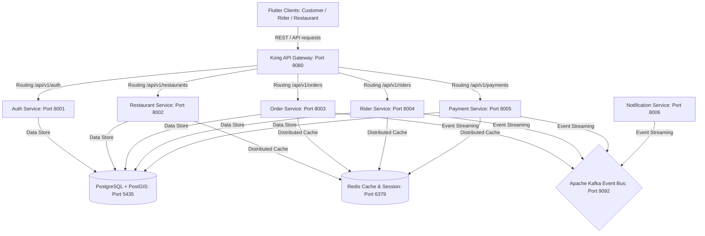
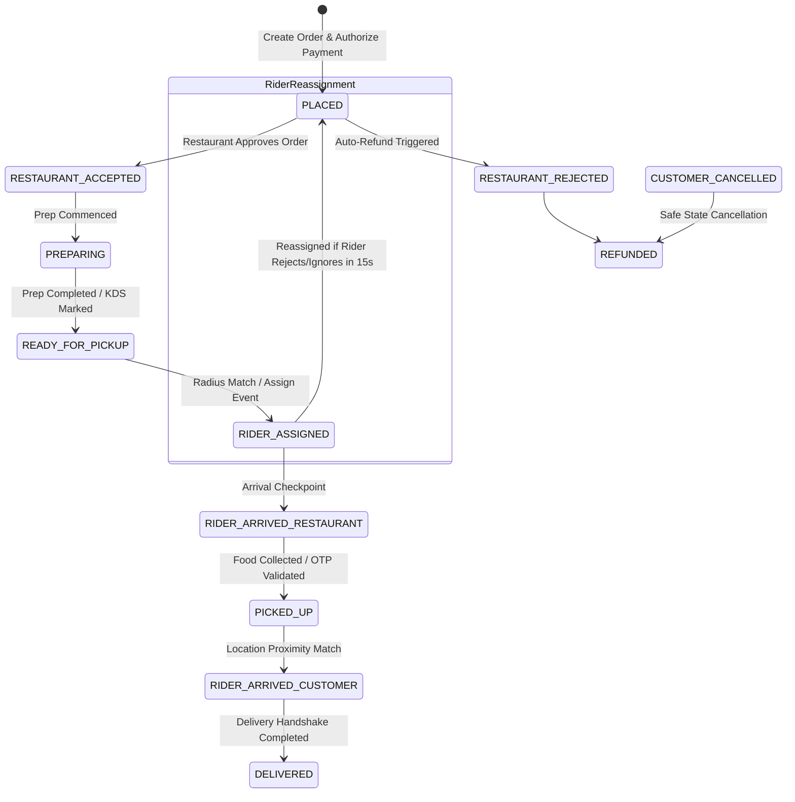

# CraveX Backend — Go Microservices Engine

The production-grade, event-driven, and highly scalable microservices architecture powering the CraveX platform (Zomato Clone).

---

## 1. System Architecture Diagram



---

## 2. Order Lifecycle State Machine



Every state transition publishes a message to the `order-events` Kafka topic.

---

## 3. Core Microservices Catalog

### Auth Service (Port 8001)
- User, partner, and rider onboarding flows.
- JWT-based authentication with validation checks.
- **OTP Abuse Prevention**: Enforces a strict rate limit of maximum 3 OTP requests/hour per phone number with exponential cooldowns (5s, then 30s) to prevent bulk spamming and brute forcing.

### Restaurant Service (Port 8002)
- Catalog searches, menus, items, categories, and availability state toggling.
- **Spatial Caching**: Rounded geohash coordinate grid caching bucket (~1.1km area) in Redis with a 2-minute TTL.
- **Write-Through Menu Cache**: Cache menu details for 5 minutes; automatically invalidates cached items immediately on item update, deletion, or category edits.
- **PostGIS Search**: Queries service zones using `ST_DWithin` spatial geometries.

### Order Service (Port 8003)
- Handles cart validation, pricing breakdowns, dynamic surge multipliers, and state changes.
- **Strict Pricing Calculations**:
  - Platform Fee: Flat ₹0.50
  - Packaging Fee: Flat ₹0.99
  - Surge multiplier: 50% delivery charge markup during peak hours (12-3pm, 7-10pm).
  - GST Splits: 5% food/packing tax vs 18% service charge tax.
  - Coupon Engine: Validation rules (e.g. `CRAVEX50` offering 50% off up to ₹5.00).
- **Idempotency**: Prevents duplicate state updates using database unique constraints on transition `event_id` fields.
- **Background ETA Predictor**: Recalculates remaining durations every 60 seconds and updates clients when delta > 2 minutes.

### Rider Service (Port 8004)
- Location updates, availability toggling, and earnings tracking.
- **Weighted Match Scoring**:
  `Score = 10 * (1 / (distance + 0.1)) + 2 * rating`
- **PostGIS Nearby Filter**: Fetches nearest riders using PostGIS `ST_DWithin` boundary queries.

### Payment Service (Port 8005)
- Processes transactions and manages user wallets.
- **Stripe Webhook Signature Verification**: Implements real-time Stripe HMAC-SHA256 signature verification to handle secure transaction state updates (`payment_intent.succeeded`).
- **Timing Attack & Replay Protection**: Uses constant-time string comparisons (`hmac.Equal`) and rejects webhook events with timestamp deltas > 5 minutes to mitigate timing and replay attack vulnerabilities.

### Notification Service (Port 8006)
- Event-driven notifications via SMS, push notifications, and emails triggered by Kafka events.

---

## 4. Scale & Performance Engineering (v3)

1. **Read/Write Splitting & Connection Pooling**:
   - Utilizes PgBouncer in transaction mode to pool microservice database connections.
   - Restricts Postgres connection pools on app bootstrap using GORM limits:
     `db.DB().SetMaxOpenConns((core_count * 2) + disk_spindles)`
2. **Database Performance Indexing**:
   - Spatial Indexes: GIST indexing on `delivery_zone` and `location` columns.
   - Composite Index: `idx_order_customer_created` on `(user_id, created_at DESC)` for high-speed user histories.
   - Partial Indexes:
     - `idx_order_status_restaurant` on active orders: `WHERE status NOT IN ('delivered', 'cancelled')`.
     - `idx_menu_item_restaurant_available` on menus: `WHERE is_available = true`.
3. **Database-Level Geospatial Triggers**:
   - Syncs rider POINT coordinate geometries automatically on latitude/longitude updates.
   - Generates a default 5km bounding box POLYGON on restaurant registration.
4. **Flutter Client Image Caching**:
   - Integrates `CachedNetworkImage` disk-cache loading for restaurant grids to prevent redundant HTTP roundtrips.
5. **Versioned Database Migrations**:
   - Schema definitions are managed as versioned migration scripts under the [database/migrations](file:///Users/apple/Desktop/zomato_clone/backend/database/migrations) directory using standard `golang-migrate` patterns, ensuring historical record tracking and automated rollback capability (`up`/`down` scripts).

---

## 5. Getting Started (Backend)

### Prerequisites
- Docker & Docker Compose
- Go 1.25

### Run Service Infrastructure
1. Copy the environment variables template file:
   ```bash
   cp .env.example .env
   ```
2. Build and launch all services in detached mode:
   ```bash
   docker compose build
   docker compose up -d
   ```

### Database Connection Parameters
- **Host**: `localhost:5435`
- **Database**: `cravex`
- **Username**: `postgres`
- **Password**: `Raj@76330Raj`

### Microservice HTTP Port Mapping

| Service | Port | Health Endpoint |
|---|---|---|
| **Kong API Gateway** | `8080` | `http://localhost:8080/api/v1` |
| **Auth Service** | `8001` | `http://localhost:8001/health` |
| **Restaurant Service** | `8002` | `http://localhost:8002/health` |
| **Order Service** | `8003` | `http://localhost:8003/health` |
| **Rider Service** | `8004` | `http://localhost:8004/health` |
| **Payment Service** | `8005` | `http://localhost:8005/health` |
| **Notification Service** | `8006` | `http://localhost:8006/health` |
| **PostgreSQL Database** | `5435` | `localhost:5435` (cravex) |
| **Redis Cache** | `6379` | `localhost:6379` |
| **Apache Kafka** | `9092` | `localhost:9092` |

---

## 6. API Documentation

The complete endpoints, request formats, schemas, and streaming channels for the microservices stack are documented in the OpenAPI 3.0 specification file:
- [openapi.yaml](file:///Users/apple/Desktop/zomato_clone/docs/openapi.yaml)

---

## 7. Security Hardening Specifications

Detailing our access controls, replay-protection webhooks, rate limiting, and parameterization models:
- [security.md](file:///Users/apple/Desktop/zomato_clone/docs/security.md)
